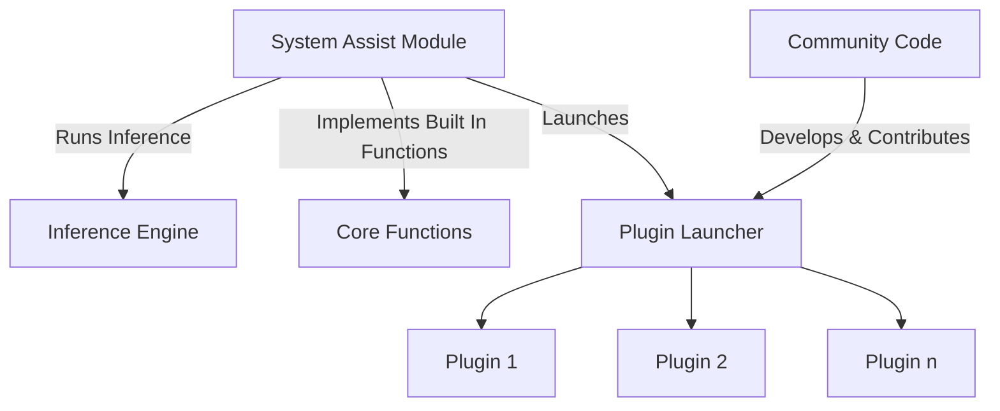

# 🚀 G-Assist System Assist Plugins

Transform your ideas into powerful G-Assist plugins! Whether you're a Python developer, C++ enthusiast, or just getting started, our plugin system makes it easy to extend G-Assist's capabilities. Create custom commands, automate tasks, or build entirely new features - the possibilities are endless!

## 📋 Table of Contents
- [Features](#-features)
- [Quick Start](#-quick-start)
- [Architecture](#-architecture)
- [Plugin Development](#-plugin-development)
- [Official Plugins](#-official-plugins)
- [Community Plugins](#-community-plugins)
- [Support](#-support)

## ✨ What Can You Build?
- 🐍 Python plugins for rapid development
- ⚡ C++ plugins for performance-critical applications
- 🤖 AI-powered plugins using our ChatGPT integration
- 🔌 Custom system interactions
- 🎮 Game and application integrations

## 🚀 Quick Start

### Python Plugin Development
Get started quickly using our Python bindings:

1. **Install the Package**
```bash
cd plugins/bindings/python-bindings
pip install .
```

2. **Create Your First Plugin**
```python
from rise import rise

# Initialize G-Assist connection
rise.register_rise_client()

# Create a simple command handler
def handle_command(command):
    return {
        "success": True,
        "message": f"Received: {command}"
    }

# Send and receive messages
response = rise.send_rise_command("Hello G-Assist!")
print(response)
```

> 💡 **Requirements**:
> - Python 3.x
> - G-Assist core services installed
> - pip package manager

See our [Python Bindings Guide](./Bindings/Python) for detailed examples and advanced usage.

## System Assist Module Architecture



### APIs to Access G-Assist
#### Register to Receive G-Assist Updates
 Informs G-Assist of a client's presence by registering a callback to the client processes. Registration also triggers models and adapters downloads for later use.
``` C++
NVAPI_INTERFACE NvAPI_RegisterRiseCallback(__in NV_RISE_CALLBACK_SETTINGS* pCallbackSettings)
```
#### Send G-Assist System Assist Requests
G-Assist clients send requests to G-Assist to run inference on their behalf

``` C++
NVAPI_INTERFACE NvAPI_RequestRise(__in NV_REQUEST_RISE_SETTINGS* requestContent)
```

To help, we've created a python binding to jumpstart your development. 
```
cd plugins\bindings\python-bindings
```
## Extending System Assistant (Plugins)
### 🔧 Technical Details
### Plugin Architecture
- `g-assist-plugin-<plugin-name>.exe` - Executable file that executes plugin functionality
- `manifest.json` - Manifest file that contains: 
    - name of the plugin
    - plugin description
    - list of functions and their parameters, with descriptions for each
    - `tags` - array of keywords used to describe the plugin's functionality
    - `persistent` [true, false] - if the plugin should remain running throughout the entire G-Assist lifecycle 
- `config.json` - Config file containing any required information for the plugin (API key, usernames, other specifications)

### 🔌 Plugin Integration
### How to Call a Plugin from G-Assist

The manifest file acts as the bridge between G-Assist and your plugin. G-Assist automatically scans the plugin directory to discover available plugins.

#### 🎯 Two Ways to Invoke Plugins:

1. 🤖 Zero-Shot Function Calling
    ```
    /fc What are the top upcoming games for 2025?
    ```
    The AI model automatically:
    - Analyzes the user's intent
    - Selects the most appropriate plugin
    - Chooses the relevant function to execute
    - Passes any required parameters

2. 📢 Direct Plugin Invocation
    ```
    Hey logiled, change my keyboard lights to green
    ```
    or
    ```
    /logiled change my keyboard lights to green
    ```
    - User explicitly specifies the plugin
    - AI model determines the appropriate function from the manifest
    - Parameters are extracted from the natural language command

> 💡 **Pro Tip**: Direct plugin invocation is faster when you know exactly which plugin you need!

## 📚 NVIDIA-Built System Assist Plugins
Explore our official plugins:
- 🤖 [Gemini AI Integration](Plugins\Examples\Gemini)
- 🎮 [Logitech Peripheral Lighting](Plugins\Examples\LogiLED)
- 🎥 [Corsair Peripheral Lighting](Plugins\Examples\Corsair)
- 💡 [Nanoleaf Room Lighting](Plugins\Examples\Nanoleaf)
- 🎵 [Spotify Music Player](Plugins\Examples\Spotify)
- [More coming soon!]

### 🤖 NVIDIA Plugin Example - Twitch
A step-by-step guide to creating a Twitch integration plugin for G-Assist.

#### ✨ Key Features
- 🔑 Secure API credential management
- 🔄 OAuth token handling
- 📝 Comprehensive logging system
- 🔌 Windows pipe communication
- ⚡ Real-time stream status checking

#### 📁 Project Structure
```
plugins/twitch/
├── manifest.json        # Plugin configuration
├── config.json          # Twitch API credentials
├── plugin.py            # Main plugin code
└── requirements.txt     # Dependencies (requests)
```

#### 🚀 Step-by-Step Tutorial

1. **Create the Manifest File** (`manifest.json`)
    ```json
    {
    "manifestVersion": 1,
    "executable": "g-assist-plugin-twitch.exe",
    "persistent": false,
    "functions": [
        {
        "name": "check_twitch_live_status",
        "description": "Checks if a Twitch user is live and retrieves stream details.",
        "tags": ["twitch", "live_status"],
        "properties": {
            "username": {
            "type": "string",
            "description": "The Twitch username to check."
            }
        }
        }
    ]
    }
    ```

2. **Set Up Configuration** (`config.json`)
    ```json
    {
    "TWITCH_CLIENT_ID": "your_client_id_here",
    "TWITCH_CLIENT_SECRET": "your_client_secret_here"
    }
    ```

3. **Create the Plugin Code** (`plugin.py`)

    First, import required modules and set up constants:
    ```python
    import json
    import logging
    import os
    import requests
    from typing import Optional, Dict, Any
    from ctypes import byref, windll, wintypes

    # Constants
    TWITCH_OAUTH_URL = "https://id.twitch.tv/oauth2/token"
    TWITCH_STREAM_URL = "https://api.twitch.tv/helix/streams"
    BUFFER_SIZE = 4096
    ```

4. **Implement Core Functions**

    Set up logging and configuration:
    ```python
    # Configure paths
    CONFIG_FILE = os.path.join(
        os.environ.get("PROGRAMDATA", "."),
        r'NVIDIA Corporation\nvtopps\rise\plugins\twitch',
        'config.json'
    )

    LOG_FILE = os.path.join(os.environ.get("USERPROFILE", "."), 'twitch.log')

    def setup_logging():
        """Configure logging with timestamp format"""
        logging.basicConfig(
            filename=LOG_FILE,
            level=logging.INFO,
            format="%(asctime)s - %(levelname)s - %(message)s"
        )

    def load_config():
        """Load Twitch API credentials"""
        try:
            if os.path.exists(CONFIG_FILE):
                with open(CONFIG_FILE, "r") as file:
                    return json.load(file)
        except Exception as e:
            logging.error(f"Error loading config: {e}")
        return {}
    ```

5. **Implement Twitch API Integration**

    The Twitch integration requires two main components: authentication and stream status checking. Let's break down each part:

    #### OAuth Token Management
    The first component handles secure authentication with Twitch's API using the OAuth 2.0 client credentials flow. This process:
    - Makes a secure POST request to Twitch's authentication endpoint
    - Uses your client ID and secret to obtain an access token
    - Handles token management for subsequent API calls
    - Implements error handling for failed authentication attempts

    Tokens typically expire after a few hours, so the system requests a new one for each status check to ensure continuous operation.

    ```python
    def get_oauth_token():
        """Obtain OAuth token from Twitch"""
        try:
            response = requests.post(
                TWITCH_OAUTH_URL,
                params={
                    "client_id": config.get("TWITCH_CLIENT_ID"),
                    "client_secret": config.get("TWITCH_CLIENT_SECRET"),
                    "grant_type": "client_credentials"
                }
            )
            return response.json().get("access_token")
        except Exception as e:
            logging.error(f"Error getting OAuth token: {e}")
            return None
    ```

    #### Stream Status Checking
    The second component queries Twitch's API to check if a user is streaming. When checking a stream's status, the system:
    - Validates the input username
    - Obtains a fresh OAuth token for authentication
    - Queries Twitch's streams endpoint with proper headers
    - Processes the response to extract relevant stream details
    - Formats the response for G-Assist

    The API returns comprehensive stream data including:
    - Stream title and game name
    - Current viewer count
    - Stream start time
    - Broadcast language
    - Thumbnail URLs

    Here's the implementation of both components:

    ```python
    def check_twitch_live_status(params: Dict[str, str]):
        """Check if a Twitch user is streaming"""
        username = params.get("username")
        oauth_token = get_oauth_token()
        
        headers = {
            "Client-ID": config.get("TWITCH_CLIENT_ID"),
            "Authorization": f"Bearer {oauth_token}"
        }
        
        response = requests.get(
            TWITCH_STREAM_URL,
            headers=headers,
            params={"user_login": username}
        )
        
        data = response.json().get("data", [])
        if data:
            stream = data[0]
            return {
                "success": True,
                "message": (
                    f"{username} is LIVE!\n"
                    f"Title: {stream['title']}\n"
                    f"Game: {stream.get('game_name', 'Unknown')}\n"
                    f"Viewers: {stream['viewer_count']}"
                )
            }
        return {"success": True, "message": f"{username} is OFFLINE"}
    ```

    > 💡 **Implementation Notes**:
    > - In order for G-Assist to display messages, response must follow this format: 
    >```json
    >{
    >    "success": true | false,
    >    "message": "<message string>"
    >}
    >```

6. **Implement Main Plugin Loop**
    ```python
    def main():
        """Main plugin execution loop"""
        setup_logging()
        logging.info("Twitch Plugin Started")
        
        while True:
            command = read_command()
            if command is None:
                continue
            
            for tool_call in command.get("tool_calls", []):
                func = tool_call.get("func")
                params = tool_call.get("params", {})
                
                if func == "check_twitch_live_status":
                    response = check_twitch_live_status(params)
                    write_response(response)
                elif func == "shutdown":
                    return

    if __name__ == "__main__":
        config = load_config()
        main()
    ```

7. **Implement Windows Pipe Communication**

    The plugin communicates with G-Assist through Windows named pipes. Here's how to implement the read and write functions:

    ```python
    def read_command() -> Optional[Dict[str, Any]]:
        """Read command from stdin pipe.
        
        Returns:
            Optional[Dict[str, Any]]: Parsed command dictionary or None if failed
        """
        try:
            pipe = windll.kernel32.GetStdHandle(STD_INPUT_HANDLE)
            chunks = []
            
            while True:
                message_bytes = wintypes.DWORD()
                buffer = bytes(BUFFER_SIZE)
                success = windll.kernel32.ReadFile(
                    pipe,
                    buffer,
                    BUFFER_SIZE,
                    byref(message_bytes),
                    None
                )

                if not success:
                    logging.error('Error reading from pipe')
                    return None

                chunk = buffer.decode('utf-8')[:message_bytes.value]
                chunks.append(chunk)

                # Break if we've read less than buffer size (end of message)
                if message_bytes.value < BUFFER_SIZE:
                    break

            message = ''.join(chunks)
            logging.info(f'Received command: {message}')
            return json.loads(message)
            
        except json.JSONDecodeError as e:
            logging.error(f'Invalid JSON received: {e}')
            return None
        except Exception as e:
            logging.error(f'Error in read_command: {e}')
            return None

    def write_response(response: Dict[str, Any]) -> None:
        """Write response to stdout pipe.
        
        Args:
            response: Dictionary containing 'success' and optional 'message'
        """
        try:
            pipe = windll.kernel32.GetStdHandle(STD_OUTPUT_HANDLE)
            # Add <<END>> marker for message termination
            message = json.dumps(response) + '<<END>>'
            message_bytes = message.encode('utf-8')
            
            bytes_written = wintypes.DWORD()
            windll.kernel32.WriteFile(
                pipe,
                message_bytes,
                len(message_bytes),
                byref(bytes_written),
                None
            )
        except Exception as e:
            logging.error(f'Error writing response: {e}')
    ```

    > 💡 **Important Implementation Notes**:
    > - The `read_command` function reads data in chunks to handle large messages
    > - Messages are expected to be JSON-formatted
    > - Responses must include the `<<END>>` marker for proper message termination
    > - Both functions include comprehensive error handling and logging
    > - Constants needed at the top of your file:
    >   ```python
    >   STD_INPUT_HANDLE = -10
    >   STD_OUTPUT_HANDLE = -11
    >   BUFFER_SIZE = 4096
    >   ```

    Example command format that the plugin expects to receive:
    ```json
    {
        "tool_calls": [{
            "func": "check_twitch_live_status",
            "params": {
                "username": "nvidia"
            }
        }]
    }
    ```

    Example response format that the plugin sends:
    ```json
    {
        "success": true,
        "message": "nvidia is LIVE!\nTitle: NVIDIA Gaming Stream\nGame: Cyberpunk 2077\nViewers: 1234"
    }<<END>>
    ```

    This implementation ensures reliable communication between G-Assist and your plugin through Windows pipes, with proper error handling and logging for debugging purposes.

#### 💡 Pro Tips
- **Security Best Practices**
  - Store API credentials in `config.json` and add it to `.gitignore`

- **Error Handling & Logging**
  - Implement comprehensive error handling with specific error types
  - Use structured logging with appropriate log levels
  - Add request/response debugging for troubleshooting

- **Performance & Reliability**
  - Implement exponential backoff for rate limits
  - Cache OAuth tokens with proper expiration handling
  - Add health checks and automatic recovery
  - Monitor API quota usage

### 🔧 Testing the Plugin
1. **Setup**
   - Get API credentials
        - Visit https://dev.twitch.tv/console to create your application

   - Configure credentials
        - Edit config.json with your Twitch Client ID and Secret

    - Run Setup Script
        ```batch
        .\setup.bat
        ```

2. **Local Testing**
    
    - Run the plugin
        ```bash
        python plugin.py
        ```
    - Test with sample command
        ```json
        {
            "tool_calls": [
                {
                    "func": "check_twitch_live_status",
                    "params": {
                        "username": "nvidia"
                    }
                }
            ]
        }
        ```

3. **Production Deployment**
    1. Set Up the Plugin
        ```bash
        ./setup.bat
        ```
    2. Modify the build script
        
        Before:
        ```bash
        :: Replace 'plugin' with the name of your plugin
        set PLUGIN_DIR=%DIST_DIR%\plugin
        ```

        After:
        ```bash
        set PLUGIN_DIR=%DIST_DIR%\twitch
        ```
    3. Modify the name of the executable to match `manifest.json`

        Before: 
        ```bash
        :: Replace 'g-assist-plugin' with the name of your plugin
        pyinstaller --onefile --name g-assist-plugin --distpath "%PLUGIN_DIR%" plugin.py
        ```

        After:
        ```bash
        pyinstaller --onefile --name g-assist-plugin-twitch --distpath "%PLUGIN_DIR%" plugin.py
        ```
    4. Build the Plugin
        ```bash
        ./build.bat 
        ```
    5. Deploy 
        
        Copy the `dist\twitch` folder to the `plugins` directory `%PROGRAMDATA%\NVIDIA Corporation\nvtopps\rise\plugins\`

> ⚠️ **Important**: Always verify manifest.json executable name matches your PyInstaller output

### 🚀 Next Steps
- **Feature Enhancements**
  - Add channel information retrieval
  - Implement stream analytics
  - Add top games listing
  - Create clip management features

- **Documentation**
  - Add usage examples
  - Write troubleshooting guide
  - Document common issues and solutions

## 🌟 Community-Built Plugins
Check out what others have built:
- [Your Plugin Here] - Submit your plugin using a pull request! We welcome contributions that:
  - Follow our [contribution guidelines](CONTRIBUTING.md)
  - Include proper documentation and examples
  - Have been tested thoroughly
  - Add unique value to the ecosystem

## 🛠️ Development Tools
- 🐍 [Python Bindings](./Bindings/Python)

## 🆘 Need Help?
- 🐛 Report issues on [GitHub](https://github.com/nvidia/g-assist)

## 📄 License
This project is licensed under the Apache License 2.0 - see the [LICENSE](LICENSE) file for details.

## 🤝 Contributing
We welcome contributions! Please see our [Contributing Guide](CONTRIBUTING.md) for details.