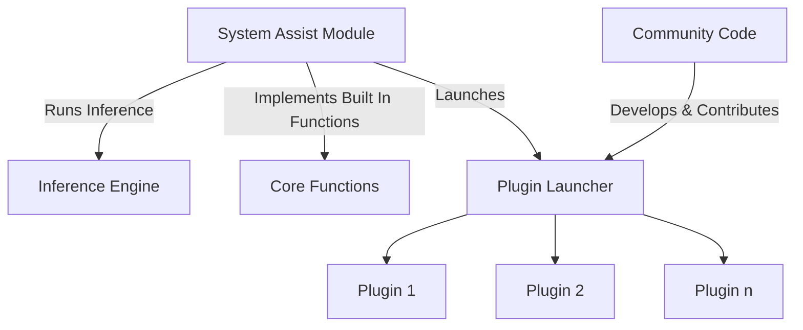

# Project G-Assist Plugins

Project G-Assist is an experimental on-device AI Assistant that helps RTX users control a broad range of PC settings, from optimizing game and system settings, charting frame rates and other key performance statistics, to controlling select peripheral lighting — all via basic voice or text commands.

Project G-Assist is built for community expansion. Whether you're a Python developer, C++ enthusiast, or just getting started — its Plugin architecture makes it easy to define new commands for G-Assist to execute. We can't wait to see what the community dreams up!

## Why Plugins Matter

- Leverage a responsive Small Language Model (SLM) running locally on your own RTX GPU
- Extend and customize G-Assist with functionality that enhances your PC experience
- Interact with G-Assist from the NVIDIA Overlay without needing to tab out or switch programs
- Invoke AI-powered GPU and system controls in your applications using C++ and python bindings
- Integrate with agentic frameworks using tools like Langflow to embed G-Assist in bigger AI pipelines

## What Can You Build?

- Python plugins for rapid development
- C++ plugins for performance-critical applications
- AI-driven features using the [ChatGPT-powered Plugin Builder](./plugins/plugin-builder/)
- Custom system interactions for hardware and OS automation
- Game and application integrations that enhance PC performance or add new commands

If you're looking for inspiration, check out our sample plugins for controling peripheral & smart home lighting, invoking larger AI models like Gemini, managing Spotify tracks, or even checking streamers' online status on Twitch — and then let your own ideas take G-Assist to the next level!

## Quick Start 

### Python Development with G-Assist
Get started quickly using our Python bindings of the [C++ APIs](https://github.com/NVIDIA/nvapi/blob/main/nvapi.h#L25283):

1. **Install the binding locally**
```bash
cd api/bindings/python
pip install .
```

2. **Chat with G-Assist**
```python
from rise import rise

# Initialize G-Assist connection
rise.register_rise_client()

# Send and receive messages
response = rise.send_rise_command("What is my GPU?")
print(f'Response: {response}')
"""
Response: Your GPU is an NVIDIA GeForce RTX 5090 with a Driver version of 572.83.
"""
```
3. **Extend G-Assist**


> 💡 **Requirements**:
> - Python 3.x
> - G-Assist core services installed
> - pip package manager

See our [Python Bindings Guide](./api/bindings/python/README.md) for detailed examples and advanced usage.

### NVIDIA Plugin Example - Twitch

Try these commands:
- "Hey Twitch, is Ninja live?"
- "Check if shroud is streaming"
- "Is pokimane online right now?"

### Example Responses

When a streamer is live:
```text
ninja is LIVE!
Title: Friday Fortnite!
Game: Fortnite
Viewers: 45,231
Started At: 2024-03-14T12:34:56Z
```

When a streamer is offline:
```
ninja is OFFLINE
```

#### Key Features
- Secure API credential management
- OAuth token handling
- Comprehensive logging system
- Windows pipe communication
- Real-time stream status checking

#### Project Structure
```
plugins/twitch/
├── manifest.json        # Plugin configuration
├── config.json          # Twitch API credentials
├── plugin.py            # Main plugin code
└── requirements.txt     # Dependencies (requests)
```
See our [Twitch Plugin Example Code](./plugins/examples/twitch/) for a step-by-step guide to creating a Twitch integration plugin for G-Assist.


## Table of Contents
- [Project G-Assist Plugins](#-project-g-assist-plugins)
- [Why Plugins Matter](#-why-plugins-matter)
- [What Can You Build?](#-what-can-you-build)
- [Quick Start](#-quick-start)
  - [Python Development with G-Assist](#-python-development-with-g-assist)
  - [NVIDIA Plugin Example - Twitch](#-nvidia-plugin-example---twitch)
- [G-Assist Module Architecture](#-g-assist-module-architecture)
- [Extending G-Assist (Plugins)](#-extending-g-assist-plugins)
  - [What Can You Build?](#-what-can-you-build-1)
  - [Plugin Architecture](#-plugin-architecture)
  - [Plugin Integration](#plugin-integration)
- [NVIDIA-Built G-Assist Plugins](#-nvidia-built-g-assist-plugins)
- [Community-Built Plugins](#-community-built-plugins)
- [Development Tools](#-development-tools)
- [Need Help?](#-need-help)
- [License](#-license)
- [Contributing](#-contributing)

## G-Assist Module Architecture



## Extending G-Assist (Plugins)

Transform your ideas into powerful G-Assist plugins! Whether you're a Python developer, C++ enthusiast, or just getting started, our plugin system makes it easy to extend G-Assist's capabilities. Create custom commands, automate tasks, or build entirely new features - the possibilities are endless!

### Plugin Architecture

Each plugin lives in its own directory named after the plugin (this name is used to invoke the plugin):

```text
plugins/
└── myplugin/              # Plugin directory name = invocation name
    ├── g-assist-plugin-my-plugin.exe  # Executable
    ├── manifest.json       # Plugin configuration
    └── config.json         # Settings & credentials
```

- `g-assist-plugin-<plugin-name>.exe` - Executable file that executes plugin functionality
- `manifest.json` - Manifest file that contains: 
    - name of the plugin executable
    - plugin description
    - list of functions and their parameters, with descriptions for each
    - `tags` - array of keywords used to describe the plugin's functionality
    - `persistent` [true, false] - if the plugin should remain running throughout the entire G-Assist lifecycle 
- `config.json` - Config file containing any required information for the plugin (API key, usernames, other specifications) (⚠️ add to `.gitignore`)

> 💡 **Tip**: The plugin directory name is what users will type to invoke your plugin (e.g., "Hey myplugin, do something")

### Plugin Integration
#### How to Call a Plugin from G-Assist

The manifest file acts as the bridge between G-Assist and your plugin. G-Assist automatically scans the plugin directory to discover available plugins.

#### Two Ways to Invoke Plugins:

1. Zero-Shot Function Calling
    ```
    /fc What are the top upcoming games for 2025?
    ```
    The AI model automatically:
    - Analyzes the user's intent
    - Selects the most appropriate plugin
    - Chooses the relevant function to execute
    - Passes any required parameters

2. Direct Plugin Invocation
    ```
    Hey logiled, change my keyboard lights to green
    ```
    or
    ```
    /logiled change my keyboard lights to green
    ```
    - User explicitly specifies the plugin
    - AI model determines the appropriate function from the manifest
    - Parameters are extracted from the natural language command

> 💡 **Pro Tip**: Direct plugin invocation is faster when you know exactly which plugin you need!

## NVIDIA-Built G-Assist Plugins
Explore our official plugins:
- [Gemini AI Integration](./plugins/examples/gemini)
- [Logitech Peripheral Lighting](./plugins/examples/logiled)
- [Corsair Peripheral Lighting](./plugins/examples/corsair)
- [Nanoleaf Room Lighting](./plugins/examples/nanoleaf)
- [Twitch Integration](./plugins/examples/twitch)
- [Spotify Music Player](./plugins/examples/spotify)
- [More coming soon!]

## Community-Built Plugins
Check out what others have built:
- [Your Plugin Here] - Submit your plugin using a pull request! We welcome contributions that:
  - Follow our [contribution guidelines](CONTRIBUTING.md)
  - Include proper documentation and examples
  - Have been tested thoroughly
  - Add unique value to the ecosystem

## Development Tools
- [Python Bindings](./api/bindings/python/)
- [ChatGPT-powered Plugin Builder](./plugins/plugin-builder/)

## Need Help?
- Report issues on [GitHub](https://github.com/nvidia/g-assist)

## License
This project is licensed under the Apache License 2.0 - see the [LICENSE](LICENSE) file for details.

## Contributing
We welcome contributions! Please see our [Contributing Guide](CONTRIBUTING.md) for details.
