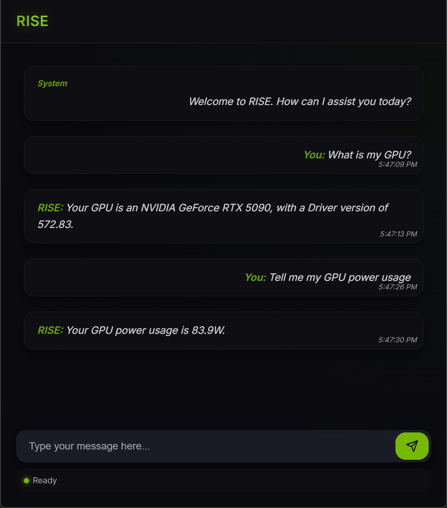

# 🚀 G-Assist Python Binding

Transform your Python applications into powerful AI-enabled experiences with G-Assist! This binding makes it incredibly easy to integrate G-Assist's capabilities into your Python projects. We've abstracted away the complexity of state machines and callbacks, making everything beautifully synchronous and straightforward.

## ✨ What Can It Do?
- 🤖 Send commands to G-Assist and receive responses with just a few lines of code
- 🔄 Synchronous, blocking calls for easier programming
- 🎯 Simple, clean API that gets out of your way
- 🧩 Easy integration into any Python project

## 📋 Before You Start
Make sure you have:
- Python 3.x installed on your computer
- pip package manager
- G-Assist core services installed on your system
- Visual C++ Build Tools (Option 1 or 2 below)

### Required Downloads
1. **Option 1: Visual Studio (Recommended for Developers)**
   - Download [Visual Studio Community](https://visualstudio.microsoft.com/vs/community/)
   - During installation, select:
     - "Desktop development with C++"
     - "Python development" (optional, but recommended)
   
   💡 **Tip**: This option is best if you plan to do any development work

2. **Option 2: Visual C++ Runtime Only**
   - Download the x64 version from Microsoft: [Visual C++ Redistributable](https://aka.ms/vs/17/release/vc_redist.x64.exe)
   - Install it before running any G-Assist Python applications
   - Restart your computer if needed

   💡 **Tip**: Choose this option if you only need to run the application

3. **Python Requirements**
```bash
pip install -r requirements.txt
```

💡 **Tip**: The "Could not find module" error often means Visual C++ components are missing or need to be updated.

## 🚀 Getting Started

### Step 1: Install the Package
From the directory where the setup.py exists, run:
```bash
pip install .
```

### Step 2: Basic Usage
Here's all you need to get started:
```python
from rise import rise

# Register your client
rise.register_rise_client()

# Send a command and get response
response = rise.send_rise_command('What is my GPU?')

# Print the response
print(response)
"""
Response: Your GPU is an NVIDIA GeForce RTX 5090 with a Driver version of 572.83.
"""
```

## 💬 Interactive Chat Example

Want to build a more interactive experience? Check out this complete chat application that includes animated thinking bubbles and colored output!

```python
from rise import rise
import time
from colorama import Fore, Style, init  # type: ignore
import sys
import threading

def thinking_bubble(stop_event):
    while not stop_event.is_set():
        for _ in range(3):
            if stop_event.is_set():
                break
            sys.stdout.write('.')
            sys.stdout.flush()
            time.sleep(0.5)
        sys.stdout.write('\b\b\b   \b\b\b')  # Erase the dots

def main():
    rise.register_rise_client()

    while True:
        # Get user input
        user_prompt = input(Fore.CYAN + "ME: " + Style.RESET_ALL)
        stop_event = threading.Event()  # Event to signal the thinking bubble to stop
        thinking_thread = threading.Thread(
            target=thinking_bubble, args=(stop_event,))
        thinking_thread.start()  # Start the thinking dots in a separate thread
        response = rise.send_rise_command(user_prompt)
        stop_event.set()  # Signal the thinking thread to stop
        thinking_thread.join()  # Wait for the thread to finish
        print(Fore.YELLOW + "RISE: " + response)

if __name__ == "__main__":
    main()
```

## 💻 G-Assist Sample GUI

Transform your G-Assist experience with our modern chat interface! This sample application provides a sleek, desktop-ready GUI for interacting with G-Assist.

### Features
- 🎨 Modern, dark-themed interface
- 💬 Real-time chat interactions
- 🔄 Live status indicators
- 🚀 Easy to use and customize

### Running the GUI
```bash
# Install required packages
pip install -r requirements.txt

# Launch the application
python rise-gui.py
```

💡 **Tip**: The GUI will automatically open in your default web browser. If it doesn't, navigate to `http://localhost:5000` manually.

### Requirements
- Node.js (for full Electron experience)
- Modern web browser
- Python packages from requirements.txt

If Node.js is not installed, the application will fall back to a simplified browser interface automatically.

## 🖼️ Sample Output


## 🔍 Troubleshooting Tips
- **Commands not working?** Make sure G-Assist core services are running
- **Installation issues?** Verify your Python version and pip installation
- **Response delays?** Check your network connection

## 🆘 Need Help?
If you run into any issues:
1. Verify that G-Assist core services are running
2. Check your Python environment setup
3. Try restarting your application

## 📄 License
This project is licensed under the Apache License 2.0 - see the LICENSE file for details.
