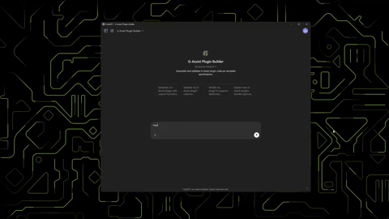

# G-Assist Plugin Builder

Transform your ideas into functional G-Assist plugins with minimal coding! This tool uses OpenAI's Custom GPT to generate plugin code, making it easier than ever to extend G-Assist's capabilities. Whether you want to create a weather plugin, a task manager, or any other custom functionality, the Plugin Builder streamlines the entire development process.

## What Can It Do?
- Generate complete plugin code using AI
- Create plugins that handle various types of queries
- Works with the G-Assist plugin system
- Minimal manual coding required

## Before You Start
Make sure you have:
- G-Assist installed on your system
- An OpenAI account
- Access to [Project G-Assist Custom GPT on OpenAI](https://chatgpt.com/g/g-67bcb083cc0c8191b7ca74993785baad-g-assist-plugin-builder) 
- Basic understanding of plugin requirements

💡 **Tip**: Familiarize yourself with G-Assist's plugin architecture before starting your development journey!

## Getting Started

### GPT Plugin Builder


### Step 1: Generate Your Plugin
1. Access the [OpenAI Custom GPT](https://chatgpt.com/g/g-67bcb083cc0c8191b7ca74993785baad-g-assist-plugin-builder) for plugin generation
2. Start by clearly describing your plugin's purpose and functionality. For example:
   - "I want to create a weather plugin that can fetch current weather for any city"
   - "I need a plugin that can manage a todo list with voice commands"
3. The GPT will guide you through the process and generate:
   - Main plugin code
   - Manifest file
   - Configuration file (if needed)
   - Installation instructions

💡 **Tip**: For best results, after the files are generated, ask the GPT to "Make sure the files follow the G-Assist Plugin template specifications". This helps catch and correct any potential inconsistencies.

### Step 2: Review and Customize
1. Examine the generated code:
   - Check that all required imports are present
   - Ensure all handler functions are properly defined
   - Review any configuration parameters
   - Ensure file paths for input and output files are correct

2. Make necessary adjustments:
   - Add error handling where needed
   - Customize response messages
   - Adjust command triggers to your preference
   - Update any hardcoded values

3. Test the plugin functionality:
   - Test each command individually
   - Verify error cases are handled gracefully
   - Check that responses are formatted correctly
   - Ensure the plugin integrates properly with G-Assist

💡 **Tip**: Ask the GPT to add logging statements to help with debugging. Example:
```python
import logging
import os

LOG_FILE = os.path.join(os.environ.get("USERPROFILE", "."), 'your_plugin.log')
logging.basicConfig(filename=LOG_FILE, level=logging.INFO, format="%(asctime)s - %(levelname)s - %(message)s")

logging.info('G-Assist plugin initialized.')
```

💡 **Tip**: Keep the `manifest.json`, `plugin.py` and `build.bat` files in sync when making changes to command handlers or plugin names.

### Step 3: Build and Deploy
Follow the standard G-Assist plugin deployment process:
```bash
pyinstaller --onedir --name your-plugin-name your_plugin.py
```

### Step 4: Install the Plugin
1. Create a new folder in the G-Assist plugins directory:
   ```
   %programdata%\NVIDIA Corporation\nvtopps\rise\plugins\your-plugin-name
   ```
2. Copy your built plugin files to this directory
  - your-plugin-name.exe
  - config.json
  - manifest.json

## Example Use Cases
You can create plugins for:
- Weather information
- Task management
- Calendar integration
- Smart home control
- Custom data fetching

💡 **Tip**: Start with a simple plugin to understand the workflow before tackling more complex projects!

## Troubleshooting Tips
- **Generation issues?** Make sure your plugin description is clear and specific
- **Build errors?** Verify all dependencies are properly installed
- **Plugin not working?** Double-check the deployment folder structure

## Want to Contribute?
We welcome contributions to improve the Plugin Builder! Whether it's:
- Adding new templates
- Improving code generation
- Enhancing documentation
- Fixing bugs

## License
This project is licensed under the Apache License 2.0 - see the [LICENSE](LICENSE) file for details.

## Need Help?
If you run into any issues:
1. Check the troubleshooting section above
2. Review the generated code for any obvious issues
3. Verify your G-Assist installation
4. Make sure your OpenAI API access is working correctly

## Acknowledgments
Special thanks to:
- OpenAI for their Custom GPT technology
- All contributors who help improve this tool